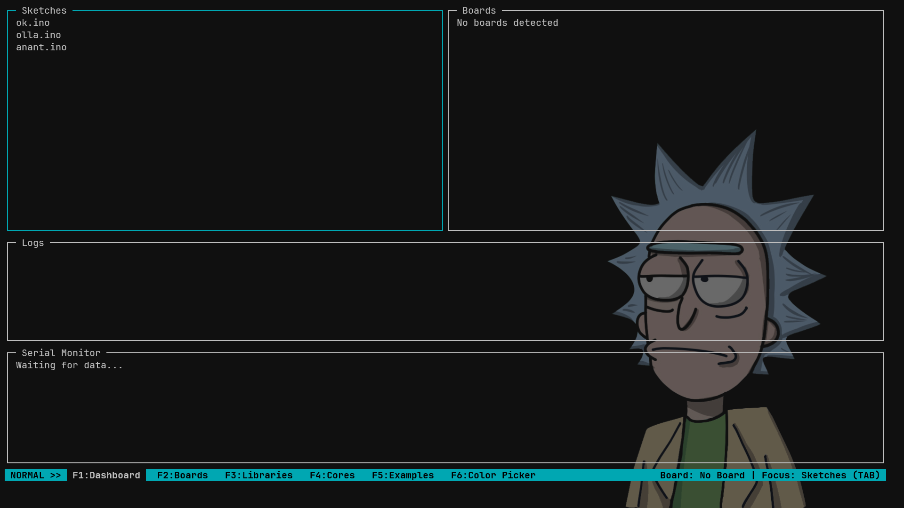
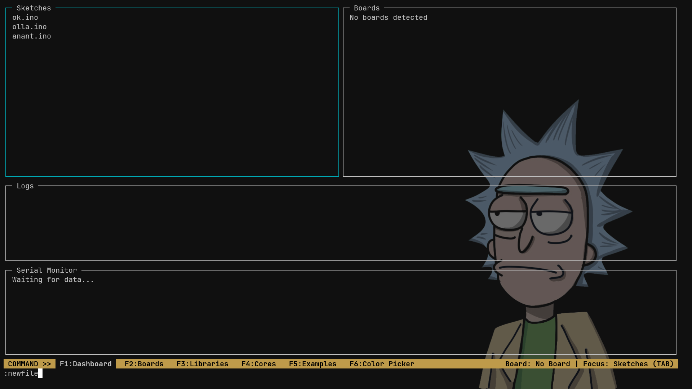

---

<table>
  <tr>
    <td width="120">
      
    </td>
    <td>
      <h1>Lazy Arduino</h1>
    </td>
  </tr>
</table>

---
***

**Lazy Arduino** is a lightweight **terminal-based user interface (TUI)** for `arduino-cli`. It aims to make Arduino development accessible for users who are new to the command line, and for those working over **SSH** or on **low-resource systems** that cannot run the full Arduino IDE.

---

## Key Features

- Minimalist, ncurses-powered TUI
- Board detection and selection
- Sketch browsing and selection
- Compile and upload with logs
- Serial monitor integration
- Modular design with page-based navigation
- Designed for SSH and low-end environments

---

## Project Goals

- Abstract away the complexity of `arduino-cli` commands
- Provide a fast, responsive UI that mirrors the Arduino IDE structure
- Enable seamless use over terminal (SSH/local) without heavy GUI tools

---

## Setup and Status

### Completed

- [x] CLI Skeleton
- [x] Sketch selection panel (basic implementation)

### In Progress

- [x] Add interaction/functionality to Sketch panel
- [x] Status bar (`status.c`) – real-time sketch/board/page info

### Next Up

- [ ] Config management (`config.c/.h`)
- [ ] TUI Framework setup
- [ ] `arduino-cli` wrapper module
- [ ] Board/Port detection screen
- [ ] Compile/upload screen with logs
- [ ] Serial monitor

### Current Interface

#### Normal Mode


#### Command Mode

---

## File Structure

```

lazy-arduino/
├── include/
│   ├── arduino.h
│   ├── board.h
│   ├── color_picker.h
│   ├── colors.h
│   ├── command.h        <-- NEW: For command registry
│   ├── config.h
│   ├── logs.h
│   ├── pages.h          <-- MODIFIED: For page registry
│   ├── panel.h          <-- NEW: For panel system
│   ├── serial.h
│   ├── sketches.h
│   ├── state.h          <-- MODIFIED: State uses indices now
│   ├── status.h
│   └── ui.h
├── src/
│   ├── arduino.c        <-- MODIFIED: Old process_cmd removed
│   ├── board.c          <-- MODIFIED: draw function signature changed
│   ├── color_picker.c
│   ├── colors.c
│   ├── command.c        <-- NEW: Command implementations
│   ├── config.c
│   ├── logs.c           <-- MODIFIED: draw function signature changed
│   ├── main.c           <-- MODIFIED: Main loop is now generic
│   ├── pages.c          <-- MODIFIED: Manages pages and panels
│   ├── serial.c         <-- MODIFIED: draw function signature changed
│   ├── sketches.c       <-- MODIFIED: Input/draw functions changed
│   ├── state.c
│   ├── status.c
│   └── ui.c
└── ... (other files)
```
i have added more Features so more files

---

## USB Device Support on WSL

If you're using **WSL (Windows Subsystem for Linux)** to interface with USB microcontrollers, you must forward the USB ports using [`usbipd-win`](https://github.com/dorssel/usbipd-win/releases).

### Steps:

1. Install `usbipd-win`
2. List USB devices:
```

usbipd list

```
3. Bind the target device:
```

usbipd bind --busid <BUSID>

```
4. Attach device in WSL:
```

usbipd attach --busid <BUSID> --wsl

```

Repeat this process every time you connect a new microcontroller.

---

## TUI Pages Overview

| Key      | Page             | Description                                  |
|----------|------------------|----------------------------------------------|
| `F1`     | Dashboard         | Sketches, Boards, Logs, Serial Monitor       |
| `F2`     | Board Manager     | View/install boards and cores                |
| `F3`     | Library Manager   | Manage libraries                             |
| `F4`     | Example Sketches  | Browse/import official or core examples      |
| `F5`     | Settings          | Configure default board, port, theme, editor |

---

## Navigation Model

- `F1–F5`: Switch between pages
- `Tab`: Cycle between panels within a page
- `q`: Quit current page or program
- `Enter` / `e`: Edit or open selection
- `c`: Compile sketch
- `u`: Upload to board
- `s`: Save config

---

## Status Bar (`status.c`)

A persistent bottom bar displays:

**[Sketch: blink.ino]  [Board: ESP32 DevKit]  [Port: /dev/ttyUSB0]  [Page: Dashboard]  [F1–F5 | Tab | q]**


This provides live feedback on current selections and available shortcuts.

### Rendering Example:
```c
mvwprintw(status_win, 0, 1,
  "[Sketch: %s]  [Board: %s]  [Port: %s]  [Page: %s]",
   selected_sketch, selected_board, selected_port, current_page_name);
````

---

## Page Layouts

### F1 — Dashboard

```
+------------------+------------------------+
|   Sketches       |     Boards             |
|   [blink.ino]    |   [ESP32 DevKit]       |
|   [wifi.ino]     |   [Arduino Uno]        |
+------------------------------------------+
|   Compile / Upload Logs                  |
|   [Success: Uploaded at 18:43]           |
+------------------------------------------+
|   Serial Monitor                         |
|   [temp = 36.4]                          |
+------------------------------------------+
```

### F2 — Board Manager

```
+----------------------------------------+
| Installed Boards / Ports               |
| [ESP32 DevKit] on /dev/ttyUSB0         |
| [Arduino Uno] on /dev/ttyUSB1          |
+----------------------------------------+
| Available Cores                        |
| [✓] esp32 @ 2.0.11   [Install]         |
| [ ] attiny85         [Install]         |
+----------------------------------------+
| Board Actions                          |
| (u) Uninstall  (i) Install (r) Refresh |
+----------------------------------------+
```

### F3 — Library Manager

```
+----------------------------------------+
| Installed Libraries                    |
| [✓] Servo       [Uninstall]            |
| [✓] Adafruit_GFX [Uninstall]           |
+----------------------------------------+
| Available Libraries                    |
| [ ] OneWire     [Install]              |
| [ ] FastLED     [Install]              |
+----------------------------------------+
| (s) Search   (i) Install   (u) Uninstall |
+----------------------------------------+
```

### F4 — Examples Browser

```
+--------------------------+
| Categories               |
| [Arduino]                |
| [ESP32]                  |
| [Adafruit]               |
+--------------------------+
| Files                    |
| blink.ino                |
| wifi_scan.ino            |
| servo_test.ino           |
+--------------------------+
| (Enter) Load  (Tab) Focus |
+--------------------------+
```

### F5 — Settings Page

```
+------------------------------------+
| Editor         : nano              |
| Default Board  : ESP32 DevKit      |
| Serial Port    : /dev/ttyUSB0      |
| Sketch Folder  : ~/Arduino         |
| Theme          : Arduino Classic   |
+------------------------------------+
| (e) Edit  (Tab) Next Field (s) Save |
+------------------------------------+
```

---

## Future Roadmap

* JSON-based persistent configuration system
* Plugin system for OTA upload, etc.
* Git integration for sketch versioning
* Error highlighting and color-coded logs

---

## Contributing

Pull requests are welcome. Please fork the repository and submit improvements via feature branches. If you plan large changes, open an issue for discussion first.

---

## License

This project will be released under the **MIT License** — free to use, modify, and distribute, as long as attribution is preserved. See `LICENSE` for full terms.

---

## Acknowledgments

* [`arduino-cli`](https://github.com/arduino/arduino-cli) — official CLI
* [`ncurses`](https://invisible-island.net/ncurses/) — terminal UI foundation
* Community feedback and contributions

---

